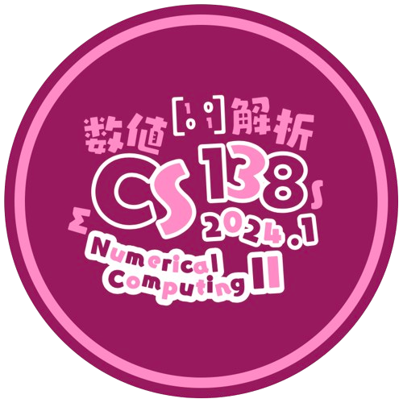

# `cs138-gizmos`

<i>I spent a whole afternoon making this</i>

## PS 1 update log

**August 29, 21:30**

- Specify usage/non-usage of pivoting for Gaussian Elimination subproblems
- Qualify LU factorization subproblems properly ("the" –> "a")
- `Flower Arrangement`: indicate that $`Z_{i,j}`$ can be $`0`$
- `Threepeater Tally`: make permutation matrix $`P`$ explicit; remove one subproblem and slightly increase value of last two subproblems
- `Tall-nut Bowling`: specify iteration matrices for spectral-radius-related subproblems

## PS 0 update log

**August 28, 14:00**

- Reword bullet point in **Instructions** to make getting $`0`$ points possible

## PS art credits

### PS 1

- wip

### PS 0

- [YouTube: _\[Blue Archive\] Hifumi's Speech no Jutsu is here!_](https://www.youtube.com/watch?v=xeMNQBdg-Wo)
  - As someone who plays BA in Japanese I personally really liked the English version of this, matches the shots so well :D
